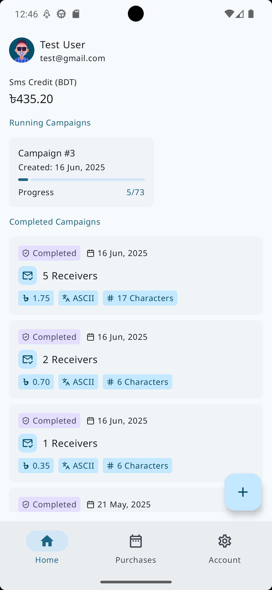
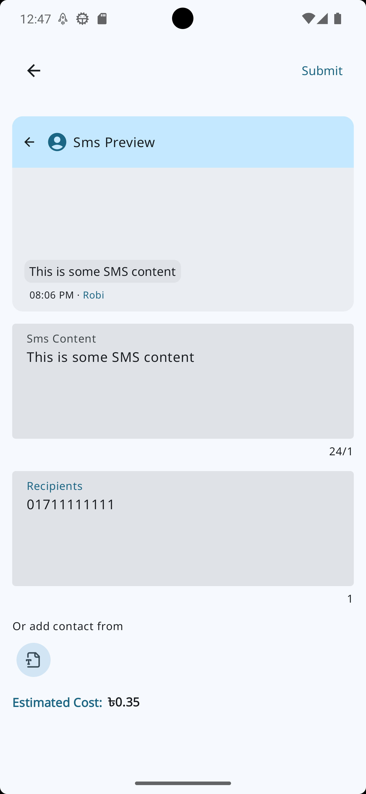

  

<h1 align="center">QSms</h1>

  Powerful SMS Campaign App for Approved Clients Only  
  Simplify campaign management with automated scheduling and tracking.

  
  
  
  

---

## Download

You can download the latest APK from the [Releases](https://github.com/Partha11/qsms-builds/releases) section.

> **Note:** Only approved customers will be able to log in and use the app. If you want to use this application, please email [@quorso](mailto:quorsotech@gmail.com) for approval.

---

## Features

- **SMS Campaigns**: Create, manage, and send SMS campaigns efficiently.
- **Automated Scheduling**: Set campaigns to send messages at user-defined intervals.
- **Custom Amount per Interval**: Define how many SMS messages to send at each interval.
- **SMS Details & Preview**: See a live preview of the SMS content while composing.
- **Purchase SMS Packages**: In-app purchasing system for sms credits.

---

## Roadmap / Upcoming Features

- [x] **CSV Import**: Upload recipient lists via CSV files.
- [x] **Advanced Scheduling**: Weekly/daily recurrence and holiday exclusion.
- [ ] **Campaign Analytics**: Track delivery, success, and performance stats.
- [ ] **Smart Filters**: Segment your recipients based on past campaign behavior.
- [ ] **Purchase Filters**: Filter your past purchases based on certain criteria.

---

## Screenshots

  
  
  
  

---

## Getting Started

1. Download the APK from [Releases](https://github.com/Partha11/qsms-builds/releases).
2. Install the APK on your Android device.
3. Log in with the credentials provided after approval.
4. Start creating SMS campaigns!

---

## License

This repository contains only the APK files. The source code is not open to the public.

View the license terms in [LICENSE.md](./license.md).

---

## FAQ

**Q: Can anyone register?**  
A: No, only pre-approved users can log in and use the app.

**Q: Where can I get support or report bugs?**  
A: Please use the [Issues](https://github.com/Partha11/qsms-builds/issues) tab for bug reports or suggestions.

---

## Contact

For inquiries or business use, please contact:  
quorsotech@gmail.com

---

